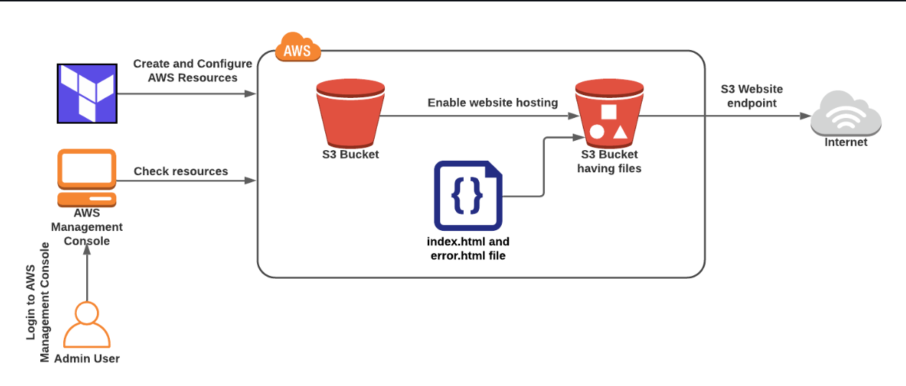
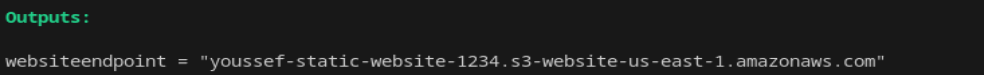
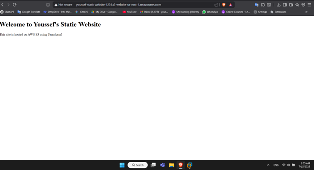

# 🚀 Terraform AWS S3 Static Website Hosting

## 📌 Project Description

This project demonstrates how to build and deploy a static website using **Terraform** and **Amazon S3** in the `us-east-1` region. The infrastructure is completely automated using Infrastructure as Code (IaC) practices.

---

## 🧱 Architecture Overview



---

## ⚙️ Key Features

- 💻 **Infrastructure as Code:** Fully defined using Terraform.
- 🪣 **S3 Bucket for Hosting:** Bucket configured for static website hosting.
- 🌐 **Public Access:** Policy for public access to website files.
- 💥 **Error Handling:** Custom error page via `error.html`.

---

## 🧰 Prerequisites

- AWS account with S3 permissions
- AWS CLI configured (`aws configure`)
- Terraform installed
- Basic knowledge of Terraform & AWS
- IDE (recommended: VS Code)

---

## 🚀 Steps to Deploy

### 1️⃣ Prepare Website Content

Create `index.html` and `error.html` in your project folder.

### 2️⃣ Terraform Files

#### `provider.tf`

```hcl
provider "aws" {
  region = "us-east-1"
}
```

#### `resource.tf`

```hcl
resource "aws_s3_bucket" "bucket1" {
  bucket = "youssef-static-website-1234"
  force_destroy = true

  website {
    index_document = "index.html"
    error_document = "error.html"
  }
}

resource "aws_s3_bucket_public_access_block" "bucket1" {
  bucket = aws_s3_bucket.bucket1.id

  block_public_acls       = false
  block_public_policy     = false
  ignore_public_acls      = false
  restrict_public_buckets = false
}

resource "aws_s3_object" "index" {
  bucket       = aws_s3_bucket.bucket1.id
  key          = "index.html"
  source       = "index.html"
  content_type = "text/html"
}

resource "aws_s3_object" "error" {
  bucket       = aws_s3_bucket.bucket1.id
  key          = "error.html"
  source       = "error.html"
  content_type = "text/html"
}

resource "aws_s3_bucket_policy" "public_read_access" {
  bucket = aws_s3_bucket.bucket1.id
  policy = <<EOF
{
  "Version": "2012-10-17",
  "Statement": [
    {
      "Effect": "Allow",
      "Principal": "*",
      "Action": "s3:GetObject",
      "Resource": [
        "${aws_s3_bucket.bucket1.arn}",
        "${aws_s3_bucket.bucket1.arn}/*"
      ]
    }
  ]
}
EOF
}
```

#### `output.tf`

```hcl
output "website_endpoint" {
  value = aws_s3_bucket.bucket1.website_endpoint
}
```

---

## ⚡ Deploy Commands

```bash
terraform init
terraform apply -auto-approve
```

---

## 🌐 Access Your Website

Terraform will output the URL. Paste it in your browser.




Example URL format:

```
http://youssef-static-website-1234.s3-website-us-east-1.amazonaws.com
```
